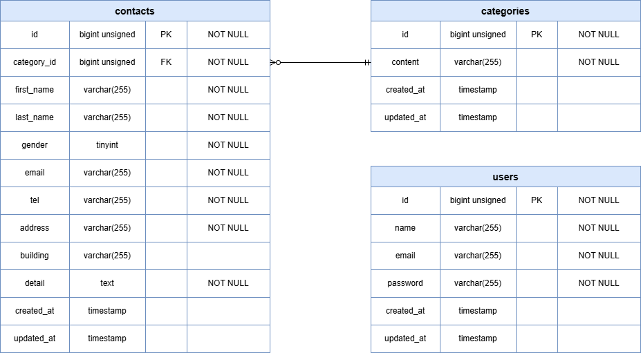

# フリマアプリ

## 環境構築

### Dockerビルド
1. リポジトリをクローン
    ```bash
    git clone git@github.com:yyoshi-dev/coachtech-flea-market-app.git
    ```

2. ディレクトリに移動
    ```bash
    cd coachtech-flea-market-app
    ```

3. コンテナを起動
    ```bash
    docker compose up -d --build
    ```

### Laravel環境構築
1. PHPコンテナに接続
    ```bash
    docker compose exec php bash
    ```

2. コンテナ内で依存関係をインストール
    ```bash
    composer install
    ```

3. `.env.example`をコピーして`.env`を作成
    ```bash
    cp .env.example .env
    ```

4. `.env`ファイルのDB設定、Stripe用API設定を修正
    ```ini
    # DB設定
    DB_CONNECTION=mysql
    DB_HOST=mysql
    DB_PORT=3306
    DB_DATABASE=laravel_db
    DB_USERNAME=laravel_user
    DB_PASSWORD=laravel_pass

    # Stripe用API設定
    STRIPE_SECRET=
    STRIPE_PUBLIC=
    ```
    ※ Stripe用のAPIキーには各自のアカウントのAPIキーを設定する事  
    ※ Stripe APIキーが未設定の場合、stripe決済処理は動作しない

    <br>

5. アプリケーションキーを生成
    ```bash
    php artisan key:generate
    ```

6. storageのシンボリックリンクを作成
    ```bash
    php artisan storage:link
    ```

7. storageディレクトリへ権限を付与
    ```bash
    find storage bootstrap/cache -type d -exec chmod 775 {} \;
    find storage bootstrap/cache -type f -exec chmod 664 {} \;
    ```
    ※ 本コマンドは php コンテナ内で実行してください

    <br>

8.  マイグレーションを実行
    ```bash
    php artisan migrate
    ```

9.  ローカル開発用のシーディングを実行
    ```bash
    php artisan db:seed --class=LocalTestSeeder
    ```
    ※ LocalTestSeederはローカル開発専用

---

## テスト

### PHP Unitを用いたテスト
- 要件シートの「テストケース一覧」に記載されているテスト要件について、PHP Unitを用いて実装している
- 以下のコードを実行する事でテストを実施出来る
  1. PHPコンテナに接続
      ```bash
      docker compose exec php bash
      ```

  2. PHP Unitを用いたテストを実行
      ```bash
      php artisan test
      ```

### 手動テスト
#### ローカル開発用のダミーデータの準備
上記の環境構築を実施すると、以下のダミーデータが生成される
- 検証用ユーザー
  - 取引有ユーザー
    - 概要: 商品出品や商品購入の実績があるユーザーであり、認証は完了済み
    - メールアドレス: `test1@example.com`
    - パスワード: `test1234`
  - 未取引ユーザー
    - 概要: 商品出品や商品購入の実績がないユーザーであり、認証は完了済み
    - メールアドレス: `test2@example.com`
    - パスワード: `test1234`
  - その他サンプルユーザー
    - ファクトリで生成したユーザーのダミーデータ
- 商品のダミーデータ
  - 要件シートの「商品データ一覧」に記載の商品
- 商品カテゴリのダミーデータ
- 商品状態のダミーデータ
- 支払い方法のダミーデータ
- いいねのダミーデータ
- 注文のダミーデータ

#### stripeのテスト

##### stripeのセットアップ
環境構築に記載の通り、StripeのAPI情報を`.env`ファイルに設定する必要有
```ini
STRIPE_SECRET=sk_test_********
STRIPE_PUBLIC=pk_test_********
```

##### stripeの処理について
- **カード支払い:** 「購入する」ボタンを押すと、Stripe決済画面に遷移し、決済を完了する事で、購入処理が完了する
- **コンビニ支払い:** 「購入する」ボタンを押した時点で、購入処理が完了する

##### stripeテスト情報
stripeのテストは以下情報を用いて実施する
- カード支払い (成功)
  - メールアドレス: 任意
  - カード番号: `4242 4242 4242 4242`
  - 有効期限: 未来の日付
  - CVC: 任意の3桁
  - 名前: 任意

**※ コンビニ支払いに関しては、「購入する」ボタンを押した時点で購入処理が完了し、商品一覧画面に遷移する実装になっており、stripeの決済処理は行わない為、stripe決済処理をテストする場合は、カード支払いを選択してください**  
**※ コンビニ支払いでは、stripe側に決済情報は送信されません**

---

## 使用技術 (実行環境)
- PHP：8.4.16
- Laravel: 12.46.0
- laravel/fortify: 1.33.0
- MySQL: 8.0.40
- nginx: 1.27.2
- phpMyAdmin: 5.2.3
- mailhog: 1.0.1
- stripe/stripe-php: v19.2.0

---

## ER図


※ 詳細要件は、[要件定義書](docs/requirements.md)に記載している

---

## URL (開発環境)
- 商品一覧画面 (トップ画面): http://localhost/
- 会員登録画面: http://localhost/register
- ログイン画面: http://localhost/login
- phpMyAdmin: http://localhost:8080/
- mailhog: http://localhost:8025/