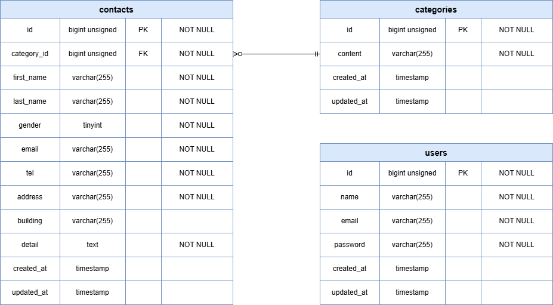

# テーブル仕様書

## テーブル仕様

### 1. usersテーブル
| カラム名           | 型              | PRIMARY KEY | UNIQUE KEY | NOT NULL | FOREIGN KEY |
| ------------------ | --------------- | ----------- | ---------- | -------- | ----------- |
| id                 | unsigned bigint | ○           |            | ○        |             |
| name               | varchar(255)    |             |            | ○        |             |
| email              | varchar(255)    |             | ○          | ○        |             |
| password           | varchar(255)    |             |            | ○        |             |
| postal_code        | varchar(8)      |             |            |          |             |
| address            | varchar(255)    |             |            |          |             |
| building           | varchar(255)    |             |            |          |             |
| profile_image_path | varchar(255)    |             |            |          |             |
| email_verified_at  | timestamp       |             |            |          |             |
| created_at         | timestamp       |             |            |          |             |
| updated_at         | timestamp       |             |            |          |             |

### 2. productsテーブル
| カラム名             | 型              | PRIMARY KEY | UNIQUE KEY | NOT NULL | FOREIGN KEY            |
| -------------------- | --------------- | ----------- | ---------- | -------- | ---------------------- |
| id                   | unsigned bigint | ○           |            | ○        |                        |
| user_id              | unsigned bigint |             |            | ○        | users(id)              |
| name                 | varchar(255)    |             |            | ○        |                        |
| brand_name           | varchar(255)    |             |            |          |                        |
| description          | varchar(255)    |             |            | ○        |                        |
| price                | integer         |             |            | ○        |                        |
| product_condition_id | unsigned bigint |             |            | ○        | product_conditions(id) |
| product_image_path   | varchar(255)    |             |            | ○        |                        |
| likes_count          | integer         |             |            | ○        |                        |
| comments_count       | integer         |             |            | ○        |                        |
| sold_at              | timestamp       |             |            |          |                        |
| created_at           | timestamp       |             |            |          |                        |
| updated_at           | timestamp       |             |            |          |                        |

### 3. product_categoriesテーブル
| カラム名   | 型              | PRIMARY KEY | UNIQUE KEY | NOT NULL | FOREIGN KEY |
| ---------- | --------------- | ----------- | ---------- | -------- | ----------- |
| id         | unsigned bigint | ○           |            | ○        |             |
| name       | varchar(255)    |             |            | ○        |             |
| created_at | timestamp       |             |            |          |             |
| updated_at | timestamp       |             |            |          |             |

### 4. product_conditionsテーブル
| カラム名   | 型              | PRIMARY KEY | UNIQUE KEY | NOT NULL | FOREIGN KEY |
| ---------- | --------------- | ----------- | ---------- | -------- | ----------- |
| id         | unsigned bigint | ○           |            | ○        |             |
| name       | varchar(255)    |             |            | ○        |             |
| created_at | timestamp       |             |            |          |             |
| updated_at | timestamp       |             |            |          |             |

### 5. product_category_relationsテーブル
| カラム名            | 型              | PRIMARY KEY | UNIQUE KEY | NOT NULL | FOREIGN KEY            |
| ------------------- | --------------- | ----------- | ---------- | -------- | ---------------------- |
| product_id          | unsigned bigint | ○           |            | ○        | products(id)           |
| product_category_id | unsigned bigint | ○           |            | ○        | product_categories(id) |

### 6. ordersテーブル
| カラム名          | 型              | PRIMARY KEY | UNIQUE KEY | NOT NULL | FOREIGN KEY         |
| ----------------- | --------------- | ----------- | ---------- | -------- | ------------------- |
| id                | unsigned bigint | ○           |            | ○        |                     |
| user_id           | unsigned bigint |             |            | ○        | users(id)           |
| product_id        | unsigned bigint |             |            | ○        | products(id)        |
| postal_code       | varchar(8)      |             |            | ○        |                     |
| address           | varchar(255)    |             |            | ○        |                     |
| building          | varchar(255)    |             |            |          |                     |
| payment_method_id | unsigned bigint |             |            | ○        | payment_methods(id) |
| created_at        | timestamp       |             |            | ○        |                     |

### 7. payment_methodsテーブル
| カラム名   | 型              | PRIMARY KEY | UNIQUE KEY | NOT NULL | FOREIGN KEY |
| ---------- | --------------- | ----------- | ---------- | -------- | ----------- |
| id         | unsigned bigint | ○           |            | ○        |             |
| name       | varchar(50)     |             |            | ○        |             |
| created_at | timestamp       |             |            |          |             |
| updated_at | timestamp       |             |            |          |             |

### 8. product_likesテーブル
| カラム名   | 型              | PRIMARY KEY | UNIQUE KEY            | NOT NULL | FOREIGN KEY  |
| ---------- | --------------- | ----------- | --------------------- | -------- | ------------ |
| id         | unsigned bigint | ○           |                       | ○        |              |
| user_id    | unsigned bigint |             | (user_id, product_id) | ○        | users(id)    |
| product_id | unsigned bigint |             | (user_id, product_id) | ○        | products(id) |
| created_at | timestamp       |             |                       |          |              |
| updated_at | timestamp       |             |                       |          |              |

### 9. product_commentsテーブル
| カラム名   | 型              | PRIMARY KEY | UNIQUE KEY | NOT NULL | FOREIGN KEY  |
| ---------- | --------------- | ----------- | ---------- | -------- | ------------ |
| id         | unsigned bigint | ○           |            | ○        |              |
| user_id    | unsigned bigint |             |            | ○        | users(id)    |
| product_id | unsigned bigint |             |            | ○        | products(id) |
| comment    | varchar(255)    |             |            | ○        |              |
| created_at | timestamp       |             |            |          |              |
| updated_at | timestamp       |             |            |          |              |

## ER図
