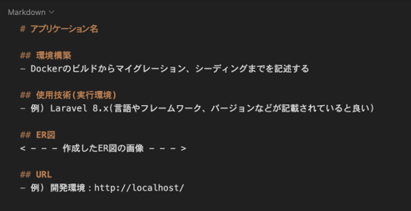
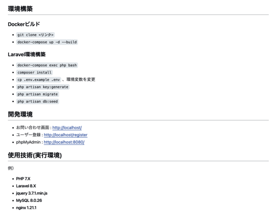

# 開発プロセス
本ドキュメントには、環境構築、コード品質、テスト要件について記載する。

## 開発プロセス

| 項目       | 要件                                    | 詳細                                                                                                                                                                                                                               | 留意点                                                                                       |
| ---------- | --------------------------------------- | ---------------------------------------------------------------------------------------------------------------------------------------------------------------------------------------------------------------------------------- | -------------------------------------------------------------------------------------------- |
| 環境構築   | README.mdを準備する事                   | 記載する情報については[参照1](#参照1)および[参照2](#参照2)を確認する事                                                                                                                                                             |                                                                                              |
|            | 環境構築が可能である事                  | README.mdに記載された方法で環境構築できるか（マイグレーションまでが対象）                                                                                                                                                          | READMEが不十分で環境構築や機能確認ができない場合は大きく減点される可能性がある               |
|            | ER図が正常か                            | テーブルの表記やカーディナリティが適正である事                                                                                                                                                                                     |                                                                                              |
|            | マイグレーションが適正か                | マイグレーションが実行でき、マイグレーションファイルとテーブル仕様書が一致している事                                                                                                                                               |                                                                                              |
|            | ダミーデータが作成可能か                | 下記の情報に対してダミーデータを作成できる事 1. 商品情報（[商品データ一覧](basic_design.md#商品データ一覧)と同じデータ） 2. 商品カテゴリー情報 3. ユーザー情報 4. テスト実行のプロセス                                 | 商品画像は素材をDLして利用する事。ダミーデータが作成できず機能確認ができない場合は減点とする |
| コード品質 | インデントおよび改行が整理されているか  | 不要な改行や不適切なインデントが存在しない事                                                                                                                                                                                       | プロジェクト概要のコーディング規約を参照する事                                               |
|            | htmlのタグ構造が適切か                  | 見出しタグがh1から順番に階層構造になっているか                                                                                                                                                                                     | プロジェクト概要のコーディング規約を参照する事                                               |
|            | htmlファイルのタグ構成が適切か          | divタグの乱用を避け、liやtable等の要素に合わせたタグを使用しているか                                                                                                                                                               | プロジェクト概要のコーディング規約を参照する事                                               |
|            | id名とclass名の命名が適正か             | idとclass名がローマ字など英単語でない命名を避け、意味の伝わる命名になっているか                                                                                                                                                    | プロジェクト概要のコーディング規約を参照する事                                               |
|            | 変数の命名が適正か                      | 意味のない命名を避け、ローマ字など英単語でない命名を避ける事                                                                                                                                                                       | プロジェクト概要のコーディング規約を参照する事                                               |
|            | コメントアウトが適正か                  | 不要なコメントアウトが残っていないか、過剰になっていないか                                                                                                                                                                         | プロジェクト概要のコーディング規約を参照する事                                               |
|            | 各ファイル名の記法が適正か              | 以下のルールを守っているか モデル名：アッパーキャメル コントローラー名：アッパーキャメル フォームリクエスト名：アッパーキャメル マイグレーションファイル名：スネークケース シーディングファイル名：アッパーキャメル | プロジェクト概要のコーディング規約を参照する事                                               |
|            | 機能要件の使用技術を遵守しているか      | 認証やバリデーションなど指定技術以外で実装していないか                                                                                                                                                                             |                                                                                              |
|            | クラスやファイルの読み込みが適正か      | 使用していないクラスやファイルをuseで読み込んでいないか                                                                                                                                                                            |                                                                                              |
| テスト     | PHPUnitを用いたテストが用意されているか | テストケース一覧に記載された要件でテストが書かれているか                                                                                                                                                                           |                                                                                              |

---

## Reference

### 参照1

### 参照2
